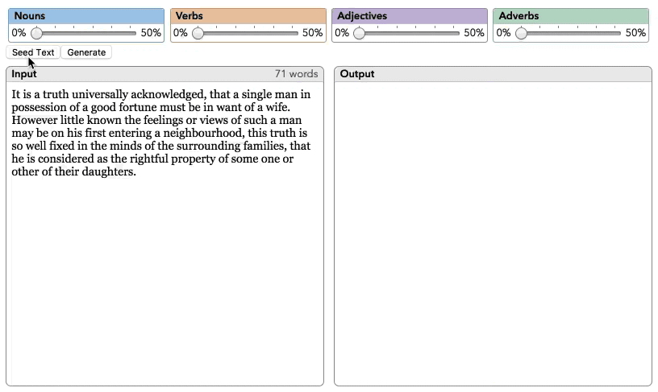

# Selexer
## Lexical randomizer for selectable parts-of-speech
### Purpose

**Selexer** is a generative/computational language tool. But instead of producing prose from scratch on the basis of rules, it takes standard English (or anything you feed it) and randomly replaces nouns, verbs, adjectives, and/or adverbs.

Supply the source text, select parts-of-speech and randomization, and **Selexer** instantly twists it. The results are often amusing, sometimes perplexing, but always unexpected.

**Selexer** is based on the [RiTa](https://rednoise.org/rita/) text analysis library, which includes a terrific set of lexicon and grammar functions.

### Features

- **Configurable** ➜  discrete controls for variability of noun, verb, adjective, adverb
- **Cross-platform** ➜  thanks to its [Electron](http://electron.atom.io/) foundation, builds to Mac OS X, Windows, and Linux

### How to Build

Until binaries becomes available, here's what you'll need ...

- [Electron](http://electron.atom.io/) ➜ for the cross-platform framework ...
- [RiTa](https://rednoise.org/rita/) ➜ for the text analysis and replacement engine ...

### Demo

